# Belajar MongoDB

## Apa itu MongoDB? (NoSQL DB)

> "The document data model maps to how you think and code."

MongoDB adalah database berbasis dokumen, di mana data disimpan dalam bentuk dokumen yang fleksibel. Struktur data dalam dokumen tersebut bisa diatur secara bebas sesuai kebutuhan, sehingga memudahkan dalam pengembangan dan integrasi dengan kode.

### Mengapa Perlu Menggunakan Database?

1. Menyimpan data dalam jumlah besar secara efisien.
2. Memiliki fungsi query untuk membuat, mengelola, dan mengambil data.
3. Menyediakan fitur keamanan dan akses kembali ke data.
4. Skalabilitas yang baik untuk menampung data dalam jumlah besar.

### SQL vs NoSQL

1. **SQL (Structured Query Language)**

   - Database relasional.
   - Skema tabel harus didefinisikan terlebih dahulu sebelum data disimpan.

2. **NoSQL**
   - Tidak menggunakan SQL sebagai bahasa query.
   - Memiliki berbagai jenis seperti dokumen, key-value, dan graph store.

### Perbedaan antara SQL (Relasional) dan NoSQL (Non-Relasional)

1. **Struktur Data**

   - **SQL**: Menggunakan tabel dengan baris dan kolom. Setiap baris adalah data, setiap kolom merepresentasikan atribut data. Struktur data bersifat tetap (skema kaku).
   - **NoSQL**: Menggunakan model data fleksibel seperti dokumen, key-value, graf, atau kolom lebar. Tidak memerlukan skema tetap (skema fleksibel).

2. **Bahasa Query**

   - **SQL**: Menggunakan Structured Query Language (SQL) dengan sintaks standar untuk mengelola dan mengakses data.
   - **NoSQL**: Tidak memiliki bahasa query standar. Pengaksesan data tergantung pada jenis NoSQL, misalnya MongoDB menggunakan query berbasis JSON-like.

3. **Skalabilitas**

   - **SQL**: Cenderung melakukan skalabilitas vertikal (meningkatkan kapasitas server dengan menambah CPU, RAM).
   - **NoSQL**: Mendukung skalabilitas horizontal (menambahkan server untuk membagi beban), cocok untuk menangani data besar.

4. **Konsistensi vs. Ketersediaan**

   - **SQL**: Mengutamakan konsistensi data (ACID: Atomicity, Consistency, Isolation, Durability).
   - **NoSQL**: Mengutamakan ketersediaan dan partisi toleransi (CAP theorem). Beberapa jenis NoSQL lebih longgar dalam hal konsistensi demi performa.

5. **Contoh Penggunaan**

   - **SQL**: Aplikasi dengan relasi data kuat, seperti sistem keuangan dan manajemen inventaris.
   - **NoSQL**: Aplikasi dengan data tidak terstruktur atau semi-terstruktur, seperti media sosial dan big data.

6. **Contoh Database**
   - **SQL**: MySQL, PostgreSQL, SQL Server, Oracle.
   - **NoSQL**: MongoDB, Cassandra, Redis, Couchbase.

## Mengapa Belajar MongoDB?

- MongoDB sering digunakan dalam proyek Node.js dan Express (misalnya: MEAN, MERN).
- Mudah dipelajari dan cocok untuk proyek JavaScript.
- Popularitasnya tinggi, sehingga banyak komunitas dan panduan.

## Apa itu BSON (Binary JSON)?

**BSON** (Binary JSON) adalah format biner yang digunakan oleh MongoDB untuk menyimpan dokumen. BSON merupakan singkatan dari **Binary JSON** dan dirancang untuk menjadi representasi efisien dari data dalam format JSON (JavaScript Object Notation) dengan beberapa keunggulan tambahan.

### Poin Penting Mengenai BSON

#### 1. Struktur Mirip JSON

BSON mirip dengan JSON karena dapat menyimpan struktur data yang kompleks seperti objek, array, dan tipe data lainnya. Namun, BSON lebih kaya dalam hal tipe data karena mendukung tipe tambahan yang tidak ada di JSON standar, seperti:

- **Date**
- **Integer (32-bit dan 64-bit)**
- **Long**
- **Double**
- **Binary**

#### 2. Format Biner

BSON menyimpan data dalam format biner, yang memungkinkan proses pembacaan dan penulisan data lebih efisien dibandingkan JSON biasa. Hal ini membuatnya lebih cepat untuk dikirimkan antara server dan aplikasi, serta lebih hemat dalam penggunaan ruang penyimpanan.

#### 3. Optimasi untuk MongoDB

BSON dirancang khusus untuk MongoDB. MongoDB menggunakan BSON sebagai format penyimpanan dokumennya untuk memastikan bahwa operasi CRUD (Create, Read, Update, Delete) dilakukan dengan cepat dan efisien.

#### 4. Tipe Data yang Didukung

BSON mendukung beberapa tipe data yang tidak ada di JSON, seperti:

- **Integer** (32-bit dan 64-bit)
- **Floating Point** (double)
- **Date** (penyimpanan waktu yang akurat)
- **Binary Data** (untuk data biner seperti file atau gambar)
- **ObjectId** (ID unik di MongoDB)
- **Null, Boolean, Array** (seperti pada JSON)

#### 5. Kompresi dan Ukuran

Meskipun BSON mengonsumsi lebih banyak ruang daripada JSON karena menyimpan informasi tambahan (seperti ukuran dokumen dan tipe data), BSON dioptimalkan untuk pembacaan cepat di MongoDB. BSON juga memungkinkan MongoDB menggunakan indeks yang efisien untuk pencarian dan manipulasi data.

### 6. Contoh Perbedaan JSON dan BSON

Misalnya, dalam JSON:

```json
{ "name": "John", "age": 30 }
```

```BSON
\x16\x00\x00\x00               // total ukuran dokumen (22 byte)
\x02                            // tipe data string untuk "name"
name\x00                        // nama field "name"
\x05\x00\x00\x00John\x00        // panjang string (5 byte), diikuti oleh string "John"
\x10                            // tipe data int32 untuk "age"
age\x00                         // nama field "age"
\x1e\x00\x00\x00                // nilai integer (30 dalam format int32)
\x00                            // akhir dari dokumen BSON
```

## Perintah Insert di MongoDB

### Insert One

`insertOne` digunakan untuk memasukkan satu dokumen ke dalam sebuah koleksi MongoDB. Perintah ini akan memasukkan satu dokumen dan mengembalikan objek hasil dengan `acknowledged: true` serta `_id` dari dokumen yang baru saja dimasukkan.

#### Contoh Penggunaan

```javascript
db.collection.insertOne({
  name: "Kemeja Flanel",
  brand: "Hollister",
  price: 750000,
  color: "biru muda",
  size: ["S", "M", "L"],
  description:
    "Kemeja flanel dengan warna yang cerah, terbuat dari bahan flanel yang nyaman dan berkualitas tinggi.",
  condition: "baru",
  stock: 25,
  availability: { online: true, offline: true },
});
```

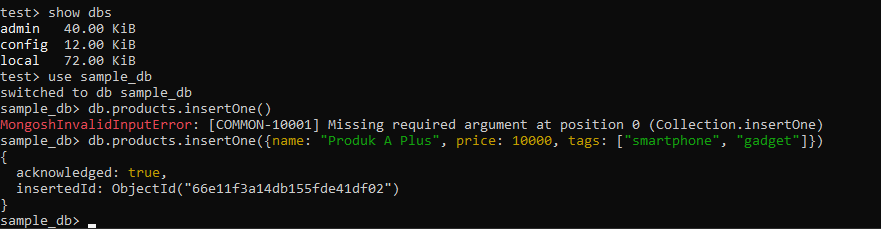
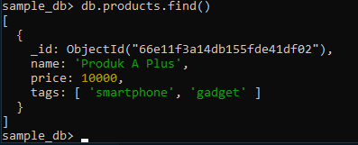

### Insert Many

`insertMany` digunakan untuk memasukkan beberapa dokumen sekaligus ke dalam sebuah koleksi. Ini sangat berguna ketika kita ingin menambahkan lebih dari satu dokumen dalam satu perintah. Sama seperti `insertOne`, perintah ini akan mengembalikan objek hasil dengan `acknowledged: true` dan daftar `_id` dari dokumen yang dimasukkan.
many.

```javascript
db.collection.insertMany([
  {
    name: "Kemeja Flanel",
    brand: "Hollister",
    price: 750000,
    color: "biru muda",
    size: ["S", "M", "L"],
    description:
      "Kemeja flanel dengan warna yang cerah, terbuat dari bahan flanel yang nyaman dan berkualitas tinggi.",
    condition: "baru",
    stock: 25,
    availability: { online: true, offline: true },
  },
  {
    name: "Sepatu Loafers",
    brand: "Gucci",
    price: 8000000,
    color: "coklat",
    size: ["40", "41", "42", "43", "44"],
    description:
      "Sepatu loafers dengan desain yang mewah dan elegan, terbuat dari bahan kulit yang berkualitas tinggi.",
    condition: "baru",
    stock: 6,
    availability: {
      online: true,
      offline: false,
    },
  },
]);
```

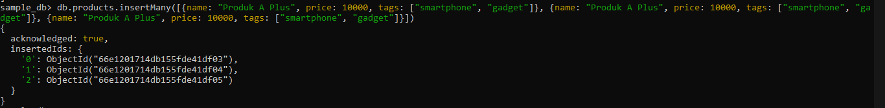
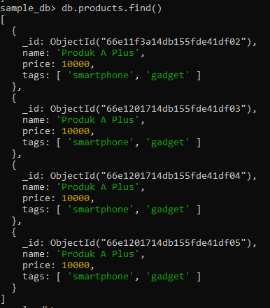

## Perintah Find dan FindOne di MongoDb

#### Find

Perintah `find` digunakan untuk mencari beberapa dokumen dalam koleksi yang memenuhi kriteria tertentu. Misalnya, untuk mencari semua dokumen di koleksi `products` yang memiliki warna "hitam", Anda bisa menggunakan:

```javascript
db.products.find({ color: "hitam" });
```

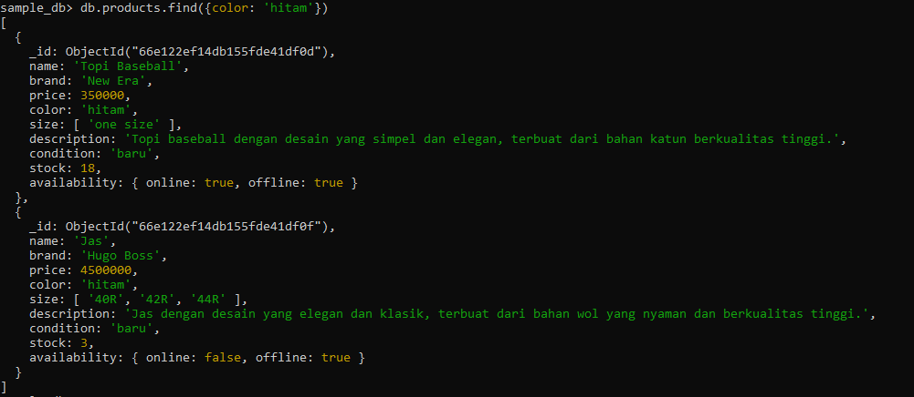

```javascript
db.products.find({ color: { $in: ["hitam", "abu-abu"] } });
```


#### Find One

Perintah `findOne` digunakan untuk mencari satu dokumen yang memenuhi kriteria tertentu. Jika ada beberapa dokumen yang cocok, hanya satu dokumen yang akan dikembalikan. Contohnya, untuk mencari satu dokumen dengan warna "hitam":

`db.products.findOne({color: 'hitam'})`

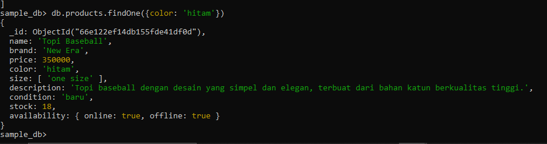

## Perintah Updateone Dan Updatemany Di Mongodb

### Update One

Perintah `updateOne` digunakan untuk memperbarui satu dokumen yang memenuhi kriteria tertentu. Misalnya, untuk memperbarui nama produk dari 'Produk A Plus' menjadi 'Product update Plus':

```javascript
`db.products.updateOne({name: 'Produk A Plus'}, {$set: { name: 'Product update Plus'}})`;
```

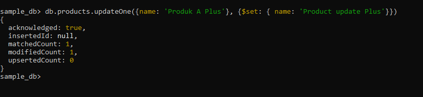

Hasil dari perintah ini dapat dilihat di gambar berikut:

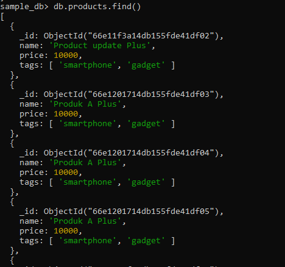

### UpdateMany

Perintah `updateMany` digunakan untuk memperbarui beberapa dokumen sekaligus. Misalnya, untuk memperbarui nama produk dari 'Produk A Plus' menjadi 'Product update Plus 2' untuk semua dokumen yang cocok:

```javascript
`db.products.updateMany({name: 'Produk A Plus'}, {$set: { name: 'Product update Plus 2'}})`;
```

```javascript
db.products.find({ name: "Product update Plus 2" });
```

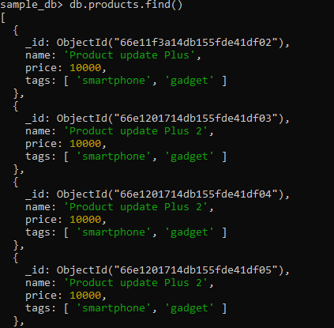

Untuk memperbarui dokumen tertentu dengan perubahan yang lebih kompleks, seperti mengubah beberapa field sekaligus, Anda bisa menggunakan `updateOne` dengan objek `$set` yang lebih detail:

```javascript
`db.products.updateOne({name: 'Product update Plus'}, {$set: {'availability.offline': true, 'availability.online' : true}})`;
```

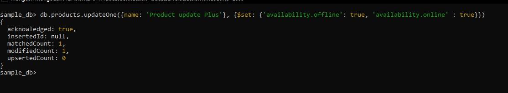

```javascript
`db.products.find({name: 'Product update Plus' })`;
```

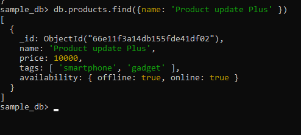

## Perintah Deleteone Dan Deletemany Di Mongodb

### Delete One

Perintah `deleteOne` digunakan untuk menghapus satu dokumen yang memenuhi kriteria tertentu. Misalnya, untuk menghapus dokumen dengan nama 'Product update Plus 2', Anda bisa menggunakan:

```javascript
`db.products.deleteOne({name: 'Product update Plus 2'})`;
```

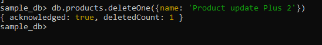

#### Hasil Hapus

Setelah perintah `deleteOne` dijalankan, Anda bisa memverifikasi bahwa dokumen tersebut telah dihapus.

### DeleteMany

Perintah `deleteMany` digunakan untuk menghapus beberapa dokumen sekaligus yang memenuhi kriteria tertentu. Misalnya, untuk menghapus semua dokumen dengan nama 'Product update Plus 2':

`db.products.deleteMany({name: 'Product update Plus 2'})`

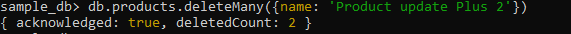

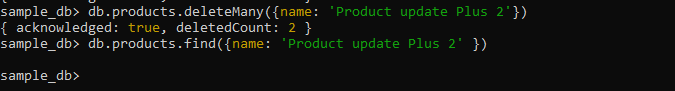

#### Hapus Berdasarkan Kriteria Lain

Anda juga bisa menggunakan `deleteMany` untuk menghapus dokumen berdasarkan kriteria yang berbeda. Misalnya, untuk menghapus semua dokumen yang memiliki `availability.offline` bernilai `false`:

`db.products.deleteMany({'availability.offline': false})`

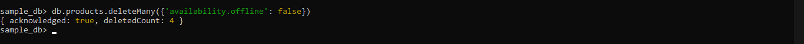

Setelah menjalankan perintah di atas, Anda dapat memverifikasi bahwa tidak ada dokumen dengan `availability.offline` yang tersisa:

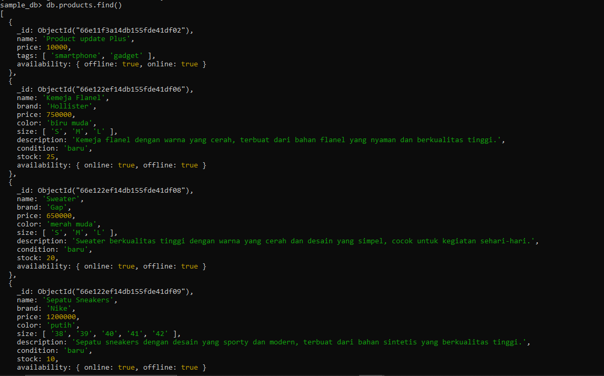

